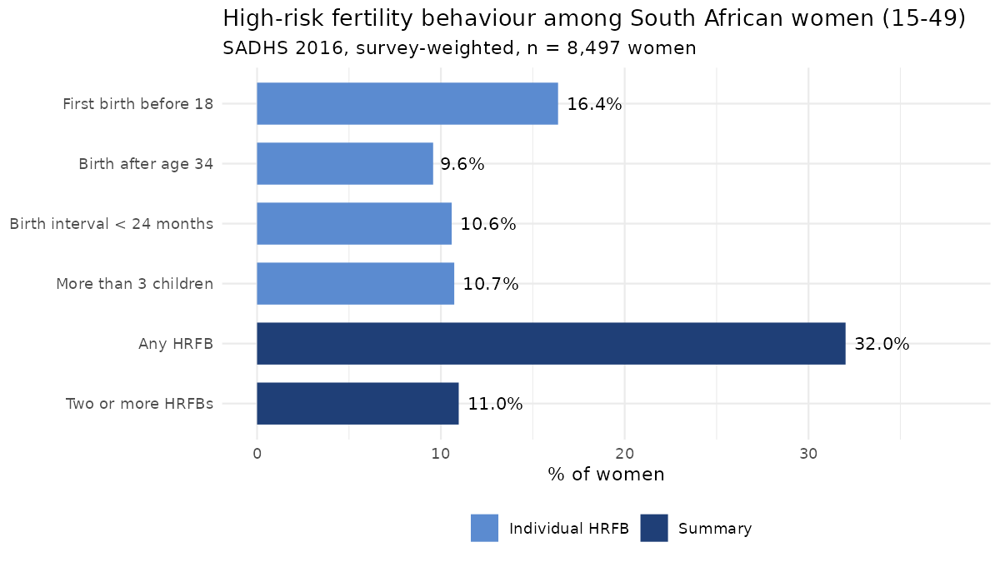
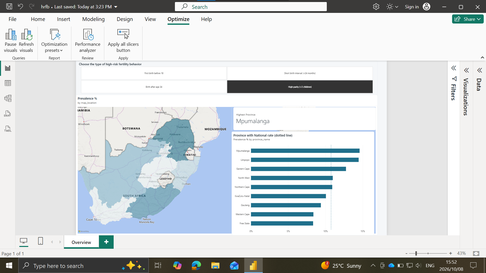
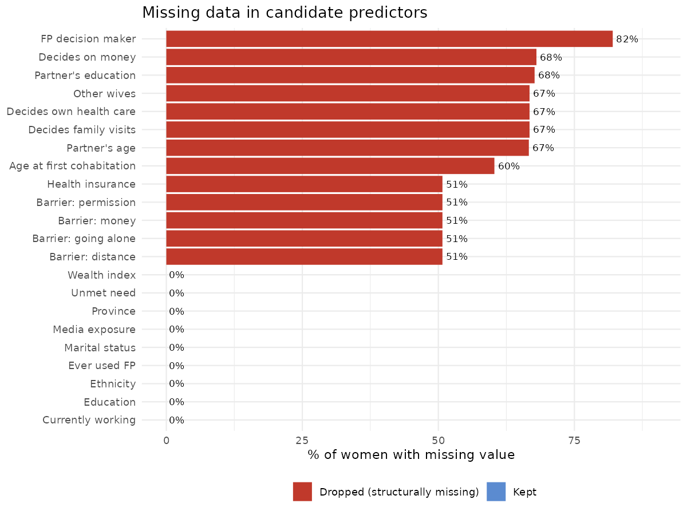
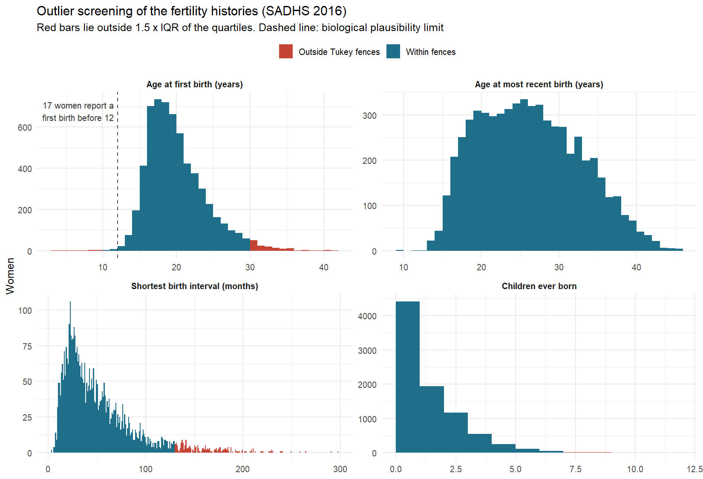
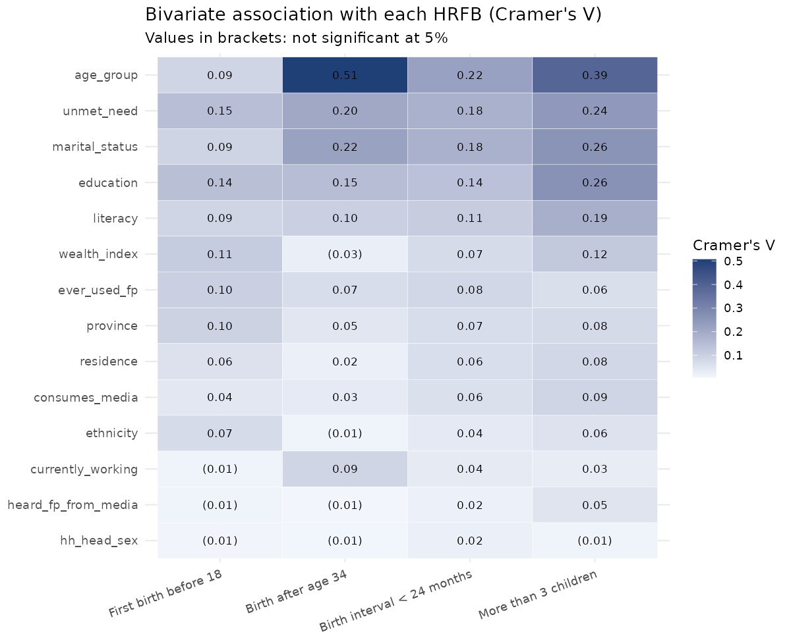
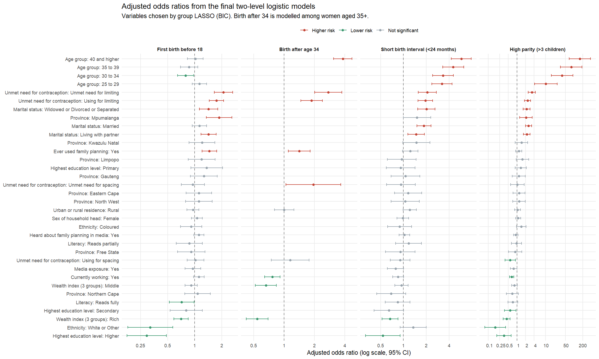
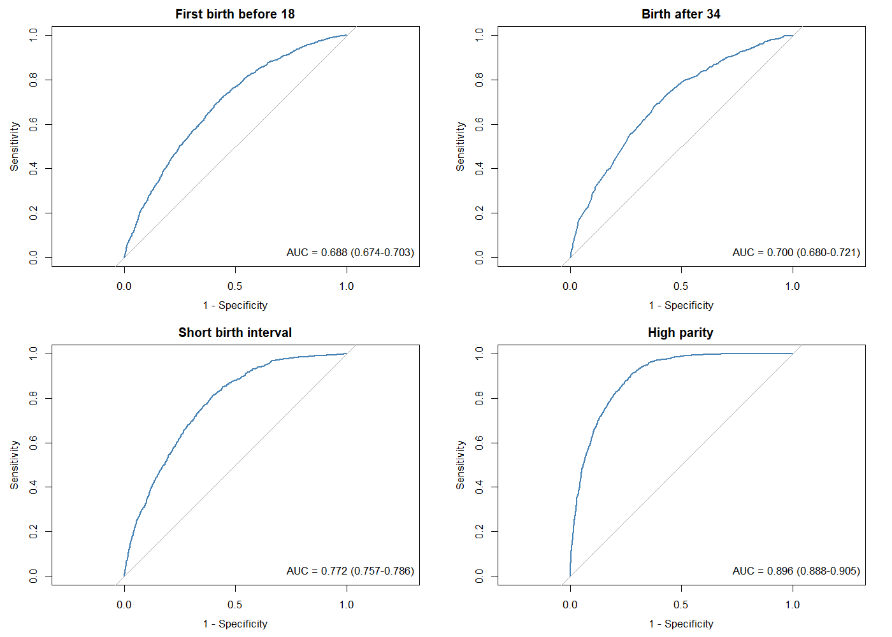

# High-Risk Fertility Behaviour among South African Women

**Which social, economic and demographic factors are linked to high-risk fertility behaviour (HRFB) in South Africa?**

High-risk fertility behaviours are four types of births that put mother and child at higher risk of illness and death. The first is giving birth at a young age (before 18). The second is giving birth after age 34; that may not seem old to some, but prior research shows the risks rise from this age. The third is spacing births too closely (less than 24 months apart), and the last is having more than 3 children. Using nationally representative survey data for 8,514 women, I investigated who is most at risk, taking into account that women living in the same community tend to behave similarly. Whether they really do had to be confirmed with the cluster variance and the intra-cluster correlation (ICC).

**Why it matters:** the aim is to develop a profile of the women most likely to have high-risk births, so that health strategists and policy-makers can direct their family-planning and maternal-health campaigns at the women at highest risk. Fewer high-risk births should mean fewer adverse maternal and child outcomes.



**About 1 in 3 South African women aged 15–49 (32%) have at least one high-risk fertility behaviour. About 1 in 9 (11%) have two or more.**

### Interactive dashboard

I have also built an interactive **Power BI** report on the results. It has a province map, breakdowns by wealth, education and age, and a forest plot of adjusted odds ratios drawn with an R visual. It uses Power Query, a star-schema data model and survey-weighted DAX measures. See [powerbi/](powerbi/README.md).

[](powerbi/README.md)

**In General:** The northern and eastern provinces, especially Limpopo and Mpumalanga showed more cases of women who engaged in high-risk fertility behaviors than their counter-parts for all types.
---

## Key findings

* **Education and wealth protect.** Women with higher education have 46–71% lower odds of an early first birth, a short birth interval and high parity than women with no education. Women in the richest households have lower odds of every one of the four outcomes (odds ratios 0.44 to 0.71).
* **Unmet need for limiting births is the strongest marker.** It is linked to 2.1–3.3 times higher odds of every outcome. This is an association, not proof that unmet need causes high-risk births (see [section 5](#5-final-two-level-logistic-models)).
* **Mpumalanga stands out.** It has about twice the odds of early first birth and high parity compared with the Western Cape, after adjusting for everything else.
* **Marriage and parity go together.** Married women, women living with a partner, and women who were previously in a union have 2.2–2.6 times the odds of having more than 3 children.
* **Communities matter, but modestly.** Before adjusting, 3–8% of the variation lies between survey clusters (median odds ratio 1.4–1.7). The predictors explain almost all of it for early first birth.
* **The models discriminate well and hold up under validation.** Cross-validated AUC ranges from 0.68 (early first birth) to 0.89 (high parity), with calibration slopes between 0.92 and 0.94.

---

## Summary

| | |
|---|---|
| **Data** | 2016 South Africa Demographic and Health Survey (SADHS): 8,514 women aged 15–49 in 729 survey clusters |
| **Outcomes** | 4 binary HRFB indicators, plus "any" and "multiple" |
| **Methods** | Data validation and outlier screening → bivariate screening (χ², Cramér's V) → **group LASSO** for mixed models (`glmmLasso`, λ by BIC), compared with ordinary and sparse group LASSO → two-level logistic regression (`lme4`) → evaluation (discrimination, calibration, DHARMa residuals, bootstrap optimism, cluster-level cross-validation, survey-weighted sensitivity analysis) |
| **Tools** | R · dplyr · ggplot2 · lme4 · glmmLasso · sparsegl · pROC · DHARMa · survey · Power BI (Power Query, DAX) |

---

## 1. Defining the outcomes

I used the standard DHS/WHO definitions and built each one from the women's birth histories:

| Outcome | Definition | Source variables | Prevalence (weighted) |
|---|---|---|---|
| Early first birth | First birth before age 18 | `V212` | 16.5% |
| Late birth | Most recent birth after age 34 | `B3_01`, `V011` (century-month codes) | 28.2% of women aged 35+ (9.6% of all women) |
| Short birth interval | Any interval between births under 24 months | `B11_01`–`B11_20` | 10.6% |
| High parity | More than 3 children ever born | `V201` | 10.8% |
| Any HRFB | At least one of the four | derived | 32.2% |
| Multiple HRFB | Two or more | derived | 11.0% |

**Decision: women with no births are coded 0 rather than treated as missing.** The 2,390 women with no children can't show any of these behaviours, and dropping them would make the results apply only to mothers. Keeping them lets the models compare women with high-risk births against all other women, including those whose circumstances have so far kept them from giving birth. The trade-off: young women who haven't had children *yet* are counted as "not at risk", which is part of why age dominates the models.

**Decision: late birth is modelled only among women aged 35 and over** (n = 2,909). A woman who is 25 cannot have had a birth after 34 yet, so nothing about her circumstances can explain that outcome. Including her would only make age a trivial predictor.

---

## 2. Data quality: validating before modelling

### Missing data



About 22 candidate predictors were screened. Two groups turned out to be **missing by design**, not at random:
- Questions about a partner and about household decision-making are only asked of women who are married or living with a partner, so 60–82% are missing.
- Health insurance and barriers to health care were only asked of a sub-sample, so 51% are missing.

**Decision:** I dropped these variables rather than impute them. Imputing a partner's age for a woman who has no partner makes no sense, and restricting the sample to women in a union would change the research question. Every variable that was kept was 100% complete.

### Consistency checks

I wrote rules that every record should satisfy and checked the data against them:

| Rule | Violations | What I did |
|---|---|---|
| Age at first birth is missing only for women with no births | 0 | — |
| Age at most recent birth is missing only for women with no births | 0 | — |
| Birth interval is missing only for women with fewer than 2 births | 18 | **All 18 turned out to be twins.** Their only births are a twin pair, so there's no interval. Coding them 0 is correct. |
| Age at first birth is at or below current age | 0 | — |

### Outliers



I screened the four quantities the outcomes are built from in two ways: **statistically**, with Tukey fences (1.5 × IQR beyond the quartiles), and **substantively**, with rules for what is biologically possible.

| Check | Women flagged | Share |
|---|---|---|
| Age at first birth below 12 (biologically implausible) | 17 | 0.20% |
| Age at first birth outside Tukey fences (below 10.5 or above 30.5) | 157 | 1.84% |
| Age at first birth above current age | 0 | 0% |
| Age at most recent birth above 49, or outside Tukey fences | 0 | 0% |
| Shortest birth interval of 0–8 months (twins or recording error) | 24 | 0.28% |
| Shortest birth interval outside Tukey fences | 206 | 2.42% |
| Children ever born outside Tukey fences | 36 | 0.42% |

**Not all statistical outliers are errors.** Most values outside the Tukey fences could be real: first births in a woman's thirties, long gaps between children, and women with eight or more children. These women are exactly the ones the late-birth and high-parity outcomes are about, so trimming them would bias the results.

**The implausible values are a different case.** The lowest recorded age at first birth is **3**, and 17 women report a first birth before 12. These are almost certainly date-of-birth entry errors. To see whether they matter, I refitted the first-birth-before-18 model without them. **No odds ratio changed by more than 6.6%** (the education estimates moved most), so I kept all 8,514 women in the analysis and report this as a sensitivity check.

Full tables: [`results/outlier_audit.csv`](results/outlier_audit.csv), [`results/outlier_sensitivity.csv`](results/outlier_sensitivity.csv). Code: [`R/02b_outlier_analysis.R`](R/02b_outlier_analysis.R).

---

## 3. Bivariate screening



For every outcome and predictor pair, I ran a χ² test of independence and used Cramér's V to measure how strong the association is. With n ≈ 8,500, even tiny associations come out statistically significant, so **effect size matters more than the p-value** here. I also checked that no expected cell count falls below 5, which the χ² test assumes.

What stands out:
- **Age group** has the strongest association with high parity (V = 0.39), followed by education (0.26) and marital status (0.26). Part of the age effect is mechanical: older women have simply had more time to have children.
- **Unmet need for contraception, marital status and education** are consistently associated with the outcomes.
- **Sex of household head** shows almost no association with any outcome (V ≤ 0.023).

---

## 4. Variable selection: group LASSO for mixed models

**Why not just screen with p-values?** Choosing predictors one at a time from bivariate tests ignores correlations between them. Education, literacy, and wealth, for example, overlap heavily. The LASSO adds a penalty that shrinks weak coefficients to exactly zero, so the selection takes all predictors into account together.

**Why `glmmLasso`?** Women are sampled in clusters, so women in the same community are not independent. `glmmLasso` fits the penalty inside a model with a random intercept for each cluster.

**Why a *group* LASSO?** A factor like province enters the model as eight dummy variables. An ordinary LASSO can drop some provinces and keep others, which leaves a factor with a strange, data-driven reference group. The group LASSO treats all dummies of a factor as one group, so **a factor is kept or dropped as a whole**.

**How the penalty was chosen:** 40 values of λ on a log scale down to 10⁻⁴, with λ chosen by **BIC**. I first used 5-fold cross-validation, but BIC needs one fit per λ instead of five, so the search runs about five times faster.

**Result:**

| Outcome | Predictors kept (of 14) |
|---|---|
| First birth before 18 | 14 |
| Birth after age 34 | 6: age group, residence, wealth, working status, ever used family planning, unmet need |
| Short birth interval | 14 |
| High parity | 14 |

For three outcomes, the LASSO kept everything: judged together, none of the predictors is redundant. For late birth it dropped eight, including province, education and marital status.

**Robustness check:** I repeated the selection with an ordinary (ungrouped) LASSO and a sparse group LASSO (`sparsegl`), each at its own BIC-optimal λ, and compared the estimates side by side.

**A bug I fixed while refactoring:** the four original selection scripts were near-identical copies, which I merged into one function. While testing it, every fit after the first λ failed silently. `glmmLasso` returns the cluster variance as a 1×1 *matrix*, and passing that back in as the next warm start breaks the fit. In my original scripts, `c()` had turned it into a number by accident. Converting it explicitly (`as.numeric()`) fixed it. Wrapping the fits in `try()` had hidden the failures, and I only noticed because the CV curve came back with a single point. I now let a failed fit stop the script.

---

## 5. Final two-level logistic models

**These are explanatory models, not predictive ones.** The goal is to understand *which* characteristics are associated with high-risk fertility behaviour, and how strongly, after accounting for everything else. In other words: how do a woman's odds of HRFB change if she has higher (tertiary) education rather than none, when her age, wealth, province and the other factors stay the same? So the quantities that matter are the odds ratios, their confidence intervals and their p-values. They say whether an association is distinguishable from chance and how large it is. Discrimination measures such as AUC appear in section 6 only as a check that the models describe the data adequately, not as the objective. A model built purely to predict would be judged differently, and could use variables with no clear interpretation.

`glmmLasso` selects variables but doesn't give valid standard errors, so I refitted the selected predictors as an ordinary (unpenalised) two-level logistic regression with `lme4::glmer`:

$$\text{logit}\,P(y_{ij}=1) = \beta_0 + \mathbf{x}_{ij}^\top\boldsymbol\beta + u_j, \qquad u_j \sim N(0, \sigma^2_u)$$

where woman *i* lives in cluster *j*.



Red points raise the odds, green points lower them and grey points are not significant at 5%. Full table: [`results/final_odds_ratios.csv`](results/final_odds_ratios.csv).

### Important: correlation is not causation (the case of unmet need)

Unmet need for limiting births has the largest odds ratios in every model, and it is tempting to read that as "meeting women's need for contraception would prevent these births". The data cannot support that claim:

* **Reverse causation.** The survey records each woman's situation at the time of the interview, *after* her births. A woman who already has four children is far more likely to say she wants no more, and so to be counted as having an unmet need *for limiting*. High parity can produce the unmet need rather than the other way round. The same applies to "ever used family planning": many women start contraception after their births, so it marks the outcome rather than preventing it.
* **Confounding.** Unmet need goes with poor access to health services, distance to clinics, partner and community attitudes, and other things the survey measures poorly or not at all. Any of these could drive both unmet need and high-risk births.
* **No time order.** With one cross-sectional survey there is no way to establish that the exposure came before the outcome, which is the first requirement for a causal claim.

So I treat unmet need and contraceptive use as **markers that identify women at higher risk**, not as causes. That is still useful for the aim of this project: a campaign can use them to *find* the women it should reach. Showing that meeting unmet need *reduces* high-risk births would need longitudinal data or an intervention study.

---

## 6. Model evaluation



| | First birth before 18 | Birth after 34 | Short birth interval | High parity |
|---|---|---|---|---|
| AUC (95% CI) | 0.69 (0.67–0.70) | 0.70 (0.68–0.72) | 0.77 (0.76–0.79) | 0.90 (0.89–0.91) |
| AUC, 5-fold CV by cluster | 0.68 | 0.69 | 0.76 | 0.89 |
| Calibration slope, CV | 0.92 | 0.94 | 0.92 | 0.93 |
| ICC, null model | 0.033 | 0.063 | 0.032 | 0.081 |
| MOR, null model | 1.38 | 1.57 | 1.37 | 1.67 |
| ICC, final model | 0.000 (singular) | 0.040 | 0.017 | 0.073 |
| Significance agrees with survey-weighted model | 30 of 34 terms | 9 of 10 | 29 of 34 | 33 of 34 |

What I checked, and why:
- **Discrimination and calibration.** AUC, Brier score, calibration slope and calibration-in-the-large, and the Hosmer–Lemeshow test.
- **Overfitting.** Harrell's bootstrap optimism (200 resamples) and 5-fold cross-validation that holds out **whole clusters**, so the test data really is new communities. The drop from apparent to validated AUC is at most 0.012.
- **Clustering.** ICC, median odds ratio and the proportional change in variance against the null model, plus a likelihood-ratio test of the random intercept. For early first birth the cluster variance shrinks to zero once the predictors are in (a singular fit), so a single-level model would do.
- **Assumptions.** DHARMa simulated residuals at woman and cluster level, and generalised VIFs (all below 2) for multicollinearity.
- **Survey design.** The GLMMs are unweighted, so I refitted each model as a survey-weighted logistic regression (weights, PSUs and strata). Significance agrees for 101 of 112 terms, and the median difference in log odds ratios is below 0.03.

Full table: [`results/final_model_evaluation.csv`](results/final_model_evaluation.csv).

---

## Limitations

1. **Age as exposure time.** Age dominates three of the four outcomes because older women have had more years in which the behaviour could happen. Analysing births rather than women, or adding years at risk as an offset, would separate the two.
2. **Cross-sectional data.** Family-planning variables are measured after the births they are meant to explain, so their associations cannot be read as causal.
3. **Selection then inference.** p-values from a model refitted after LASSO selection are optimistic. I report them alongside the penalised estimates and interpret them cautiously.
4. **Weights in the multilevel models.** The main models are unweighted. The survey-weighted refit agrees closely, but a weighted multilevel estimator (e.g. `WeMix`) would be the stronger check.

---

## Repository structure

```
├── R/
│   ├── 01_data_pipeline.R            # read DHS file, derive outcomes, recode predictors
│   ├── 02_eda.R                      # variable summaries, factor levels, prevalence
│   ├── 02b_outlier_analysis.R        # outlier screening, audit table, sensitivity refit
│   ├── 03_bivariate_chisq.R          # χ² tests and Cramér's V for every outcome × predictor
│   ├── 04_group_lasso_selection.R    # group LASSO (glmmLasso), λ by BIC
│   ├── 04c_ordinary_glmmlasso.R      # ordinary LASSO, same grid and rule, for comparison
│   ├── 05_final_glmm.R               # final two-level logistic models (lme4)
│   ├── 06_selection_table.R          # LaTeX table of the selection results
│   ├── 07_forest_plot.R              # reusable forest-plot functions for glmer/glm models
│   ├── 08_model_evaluation.R         # fit, clustering, calibration, DHARMa, bootstrap, CV, weights
│   ├── 09_sparse_group_lasso.R       # sparse group LASSO (sparsegl), for comparison
│   ├── 10_compare_lasso_estimates.R  # the three penalised methods side by side
│   ├── 11_portfolio_figures.R        # forest plot in this README, drawn from results/
│   └── preliminary/                  # my first version of the pipeline (5-fold CV LASSO)
├── run_all.R                         # runs steps 01 to 11 in order
├── data/README.md                    # how to get the SADHS data (not included)
├── figures/
├── results/                          # aggregated tables only (CSV)
└── powerbi/                          # Power BI report, its aggregated data, theme and build guide
```

**Reproduce:** get the data (see [data/README.md](data/README.md)), then run `Rscript run_all.R` from the repository root. `R/11_portfolio_figures.R` needs no survey data and runs from a fresh clone.

**Data note:** the SADHS microdata is **not included**, as required by the DHS Program's terms of use. Only aggregated results are published.

## References

- National Department of Health, Stats SA, SAMRC & ICF (2019). *South Africa Demographic and Health Survey 2016.* Pretoria and Rockville, MD.
- Groll, A. & Tutz, G. (2014). Variable selection for generalized linear mixed models by L1-penalized estimation. *Statistics and Computing*, 24(2), 137–154.
- Bates, D., Mächler, M., Bolker, B. & Walker, S. (2015). Fitting linear mixed-effects models using lme4. *Journal of Statistical Software*, 67(1).
- Merlo, J. et al. (2006). A brief conceptual tutorial of multilevel analysis in social epidemiology: using measures of clustering in multilevel logistic regression. *Journal of Epidemiology & Community Health*, 60(4), 290–297.
- Rutstein, S.O. & Winter, R. (2014). *The effects of fertility behavior on child survival and child nutritional status.* DHS Analytical Studies No. 37. ICF International.

---

*Rolivhuwa Thomoli · BSc Honours Statistics, University of Venda*
