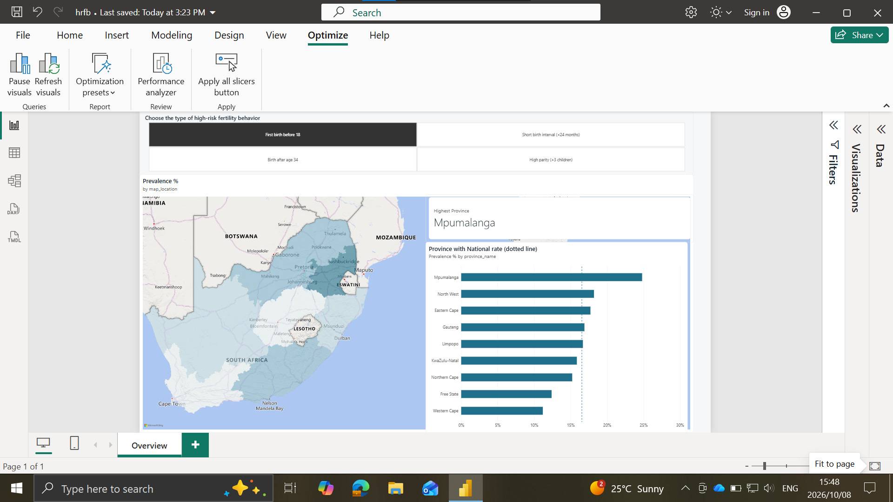
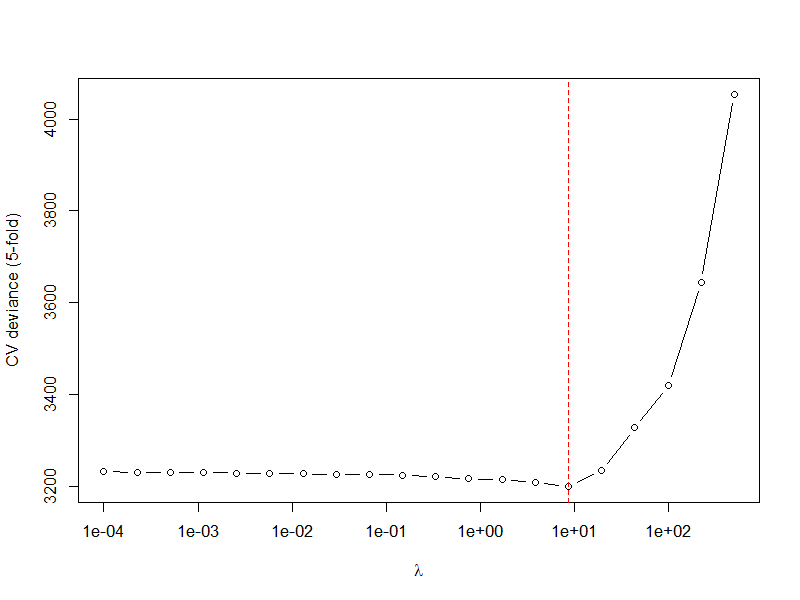

# High-Risk Fertility Behaviour among South African Women

**Which social, economic and demographic factors are linked to high-risk fertility behaviour (HRFB) in South Africa?**

> 🚧 **Work in progress.** This is my BSc Honours research project in Statistics at the University of Venda. The data pipeline and exploratory analysis are complete. The modelling results below are **preliminary** and may change as the analysis is finalised with my supervisor.

High-risk fertility behaviour means births that put mother and child at higher risk of illness and death. The four types are having a first birth very young, giving birth at an older age, spacing births too closely, and having many children. I'm using nationally representative survey data for 8,497 women to find out who is most at risk, taking into account that women living in the same community tend to be similar.


**About 1 in 3 South African women aged 15–49 (32%) have at least one high-risk fertility behaviour. About 1 in 9 (11%) have two or more.**

### Interactive dashboard

I also built an interactive **Power BI** report on the results. It has a province map, breakdowns
by wealth, education and age, and a forest plot of adjusted odds ratios drawn with an R visual.
It uses Power Query, a star-schema data model and survey-weighted DAX measures.
See [powerbi/](powerbi/README.md).

[](powerbi/README.md)

---

## Summary

| | |
|---|---|
| **Data** | 2016 South Africa Demographic and Health Survey (SADHS): 8,497 women aged 15–49 in 729 survey clusters |
| **Outcomes** | 4 binary HRFB indicators, plus "any" and "multiple" |
| **Methods** | Data validation → bivariate screening (χ², Cramér's V) → LASSO variable selection for mixed models (`glmmLasso`, 5-fold CV) → two-level logistic regression (`lme4`) |
| **Tools** | R · dplyr · ggplot2 · lme4 · glmmLasso · foreign · Power BI (Power Query, DAX) |
| **Status** | Pipeline and exploratory analysis done; modelling in progress |

---

## 1. Defining the outcomes

I used the standard DHS/WHO definitions and built each one from the women's birth histories:

| Outcome | Definition | Source variables | Prevalence (weighted) |
|---|---|---|---|
| Early first birth | First birth before age 18 | `V212` | 16.4% |
| Late birth | Most recent birth after age 34 | `B3_01`, `V011` (century-month codes) | 9.6% |
| Short birth interval | Any interval between births under 24 months | `B11_01`–`B11_20` | 10.6% |
| High parity | More than 3 children ever born | `V201` | 10.7% |
| Any HRFB | At least one of the four | derived | 32.0% |
| Multiple HRFB | Two or more | derived | 11.0% |

**Decision: women with no births are coded 0 rather than treated as missing.** The 2,390 women with no children can't show any of these behaviours, and dropping them would make the results apply only to mothers. Many DHS studies instead limit the sample to recent births. I chose the whole-population view because the policy question is about all women of reproductive age. The trade-off: young women who haven't had children *yet* are counted as "not at risk", which is part of why age dominates the models (see [Limitations](#limitations-and-next-steps)).

---

## 2. Data quality: validating before modelling

### Missing data


About 22 candidate predictors were screened. Two groups turned out to be **missing by design**, not at random:
- Questions about a partner and about household decision-making are only asked of women who are married or living with a partner, so 60–82% are missing.
- Health insurance and barriers to health care were only asked of a sub-sample, so 51% are missing.

**Decision:** I dropped these variables rather than impute them. Imputing a partner's age for a woman who has no partner makes no sense, and restricting the sample to women in a union would change the research question. Every variable I kept is 100% complete.

### Consistency checks

I wrote rules that every record should satisfy and checked the data against them:

| Rule | Violations | What I did |
|---|---|---|
| Age at first birth is missing only for women with no births | 0 | — |
| Age at most recent birth is missing only for women with no births | 0 | — |
| Birth interval is missing only for women with fewer than 2 births | 18 | **All 18 are twins.** Their only births are a twin pair, so there's no interval. Coding them 0 is correct. |
| Age at first birth is at or below current age | 0 | — |

### Outliers

One woman was recorded as giving birth at **age 3**. She was born in 1972, with a first birth in 1975, which is almost certainly a date-of-birth entry error. Seventeen women have a recorded first birth before age 12.

**Decision:** I remove records with age at first birth under 12 as biologically implausible.

**What I caught on review:** my first version of this filter also removed anyone with a first birth at **29 or older** (`age_at_first_birth < 29 & > 11`). That would have silently dropped **290 women** with perfectly normal late first births. It would also have biased the "late birth" outcome, because those are exactly the women most likely to give birth after 34. Only the implausibly *low* end is trimmed now.

---

## 3. Bivariate screening


For every outcome and predictor pair, I ran a χ² test of independence and used Cramér's V to measure how strong the association is. With n ≈ 8,500, even tiny associations come out statistically significant, so **effect size matters more than the p-value** here. I also checked that every expected cell count is at least 5, which the χ² test assumes. The smallest was 9.4.

What stands out:
- **Age group** has by far the strongest association with late birth (V = 0.51) and high parity (0.39). That's partly mechanical, because older women have simply had more time to have children.
- **Unmet need for contraception, marital status and education** are consistently associated with all four outcomes.
- **Sex of household head** and **hearing family-planning messages in the media** show almost no association with any outcome.

---

## 4. Variable selection: LASSO for mixed models

**Why not just screen with p-values?** Choosing predictors one at a time from bivariate tests ignores correlations between them. Education, literacy and wealth, for example, overlap heavily. The LASSO adds a penalty that shrinks weak coefficients to exactly zero, so the selection takes all predictors into account together.

**Why `glmmLasso` rather than `glmnet`?** Women are sampled in clusters, so women in the same community are not independent. `glmmLasso` fits the LASSO penalty inside a model with a random intercept for each cluster.

**How the penalty was chosen:** I used 5-fold cross-validation over 20 values of λ from 500 down to 0.0001, with warm starts. Each fit starts from the previous solution, which makes the search faster and more stable.

**Result from my cross-validation runs:** CV deviance was essentially flat for λ below about 10, and the penalty chosen by CV **kept all 14 candidate predictors** for every outcome.


*Example 5-fold CV curve from one of my runs. Deviance only starts to rise sharply once the penalty is strong enough to remove real signal.*

**How I read this:** the LASSO didn't simplify the model, but it did something useful. Once each predictor is judged alongside all the others, none of them is redundant. That included two predictors, household head's sex and hearing family-planning messages in the media, that I would have dropped based on the bivariate tests in section 3. Their effects are small, but the penalised model doesn't treat them as noise.

**A bug I fixed while refactoring:** the four original selection scripts were near-identical copies, which I merged into one function `run_glmmlasso_cv()`. While testing it, every fit after the first λ failed silently. glmmLasso returns the cluster variance as a 1×1 *matrix*, and passing that back in as the next warm start breaks the fit. In my original scripts, `c()` had turned it into a number by accident. Converting it explicitly (`as.numeric()`) fixed it. Wrapping the fits in `try()` hid the failures, and I only noticed because the CV curve came back with a single point. I now check the number of successful fits after every run.

---

## 5. Two-level logistic models (preliminary)

`glmmLasso` selects variables but doesn't give valid standard errors, so I refitted the selected predictors as an ordinary (unpenalised) two-level logistic regression with `lme4::glmer`:

$$\text{logit}\,P(y_{ij}=1) = \beta_0 + \mathbf{x}_{ij}^\top\boldsymbol\beta + u_j, \qquad u_j \sim N(0, \sigma^2_u)$$

where woman *i* lives in cluster *j*.

With all 14 predictors kept, the adjusted odds ratios look like this:


| Outcome | Cluster variance | ICC | Note |
|---|---|---|---|
| First birth before 18 | ≈ 0 | 0.00 | Singular fit: no clustering left once the predictors are in |
| Birth after 34 | 0.10 | 0.03 | |
| Short birth interval | 0.06 | 0.02 | |
| High parity | 0.26 | 0.07 | Strongest community-level clustering |

**Consistent patterns across outcomes (preliminary):**
- **Education and wealth protect.** Women with higher education have roughly 50–70% lower odds of early first birth, short birth intervals and high parity. Women in the richest group have 28–56% lower odds of every type of HRFB.
- **Unmet need for limiting births is the strongest modifiable factor.** It is linked to 2–3.3 times higher odds of every outcome.
- **Mpumalanga stands out.** It has about 1.5–2.1 times higher odds of early first birth, short intervals and high parity than the Western Cape.
- **Marital status matters most for parity.** Married women, women living with a partner, and women who were previously in a union all have more than twice the odds of having more than 3 children.

**Interpreting these with care:** this is cross-sectional data, so some associations probably run the *other way*. Women who have already had several children are more likely to *want to limit* births (unmet need for limiting) and to have *started* using contraception (ever used FP). So these variables partly reflect the outcome rather than cause it. In the final write-up I'll frame them as markers, not risk factors.

---

## Limitations and next steps

These are issues I've identified and am working through:

1. **Survey weights.** The prevalence estimates use the DHS sampling weights, but the models don't yet. Next steps are weighted multilevel estimation (e.g. `WeMix`, or scaled weights in `glmmTMB`) and a design-based check with the `survey` package.
2. **Age as exposure time.** Age dominates three of the four outcomes because older women have had more years in which the behaviour could happen. Options are restricting to women aged 25+, adding an offset for years at risk, or analysing births rather than women.
3. **Singular fits.** Where the cluster variance is estimated as zero, the random intercept adds nothing. Some fits also give convergence warnings. I need to report the intra-cluster correlation (ICC), justify keeping or dropping the multilevel structure for each outcome, and check the fits with other optimisers and `glmmTMB`.
4. **Literacy coding.** "No card in the required language" is currently grouped with "reads partially". Treating it as missing is a sensitivity check still to do.
5. **Selection-then-inference.** p-values from a model refitted after LASSO selection are optimistic. I'll present them alongside the penalised estimates and interpret them cautiously.

---

## Repository structure

```
├── R/
│   ├── 01_prepare_data.R        # read DHS file, derive outcomes, recode predictors, remove outliers
│   ├── 02_explore.R             # missing-data audit, consistency checks, prevalence, χ² screening
│   ├── 03_variable_selection.R  # glmmLasso with 5-fold CV (one function for all outcomes)
│   └── 04_multilevel_models.R   # glmer refit, odds ratios, ICC, forest plot
├── run_all.R                    # runs the whole pipeline
├── data/README.md               # how to get the SADHS data (not included)
├── figures/
├── results/                     # aggregated tables only (CSV)
└── powerbi/                     # Power BI report, its aggregated data, theme and build guide
```

**Reproduce:** get the data (see [data/README.md](data/README.md)), then run `Rscript run_all.R`.

**Data note:** the SADHS microdata is **not included**, as required by the DHS Program's terms of use. Only aggregated results are published.

## References

- National Department of Health, Stats SA, SAMRC & ICF (2019). *South Africa Demographic and Health Survey 2016.* Pretoria and Rockville, MD.
- Groll, A. & Tutz, G. (2014). Variable selection for generalized linear mixed models by L1-penalized estimation. *Statistics and Computing*, 24(2), 137–154.
- Bates, D., Mächler, M., Bolker, B. & Walker, S. (2015). Fitting linear mixed-effects models using lme4. *Journal of Statistical Software*, 67(1).
- Rutstein, S.O. & Winter, R. (2014). *The effects of fertility behavior on child survival and child nutritional status.* DHS Analytical Studies No. 37. ICF International.

---

*Rolivhuwa Thomoli · BSc Honours Statistics, University of Venda*
