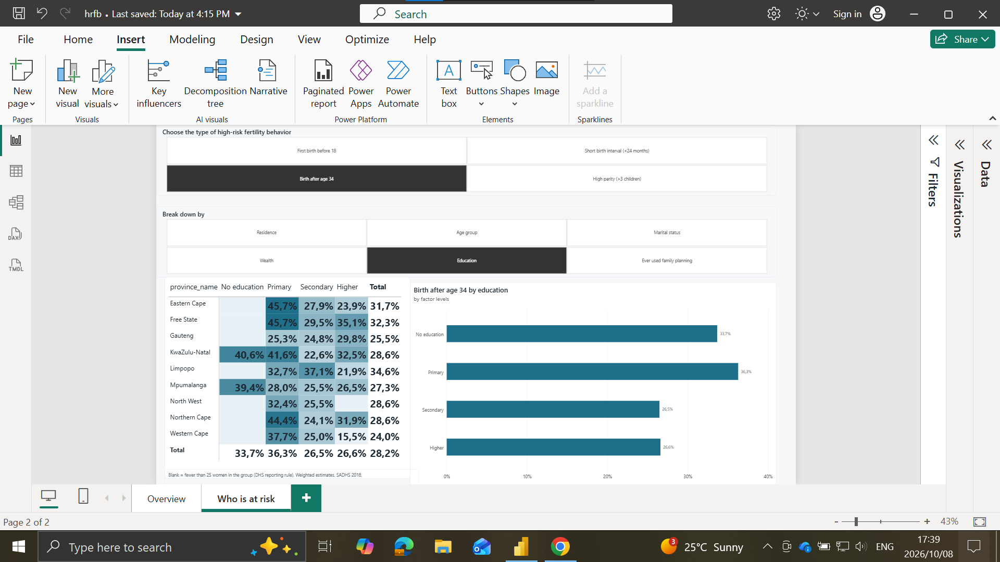
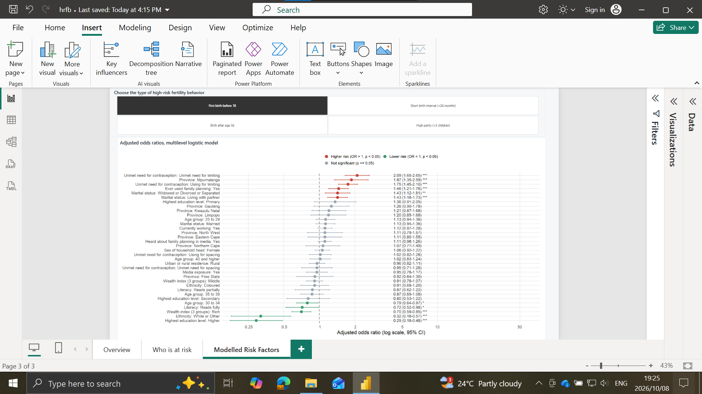
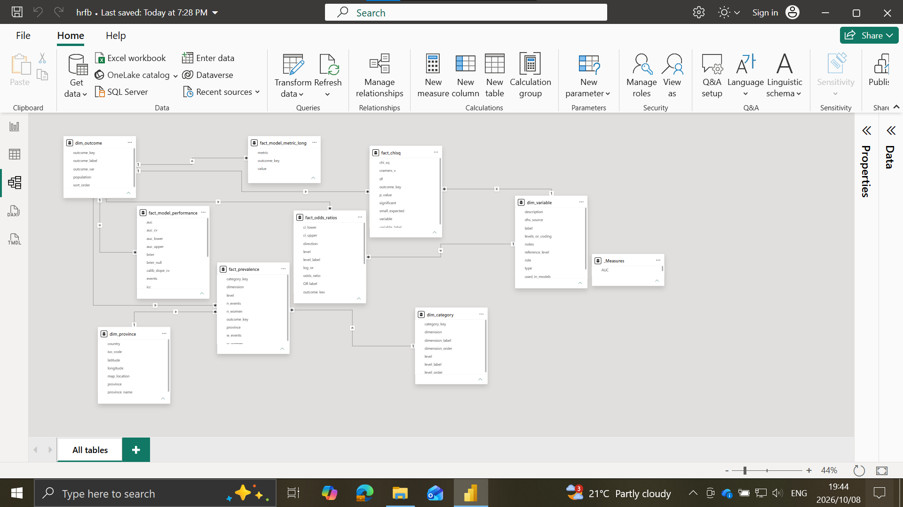
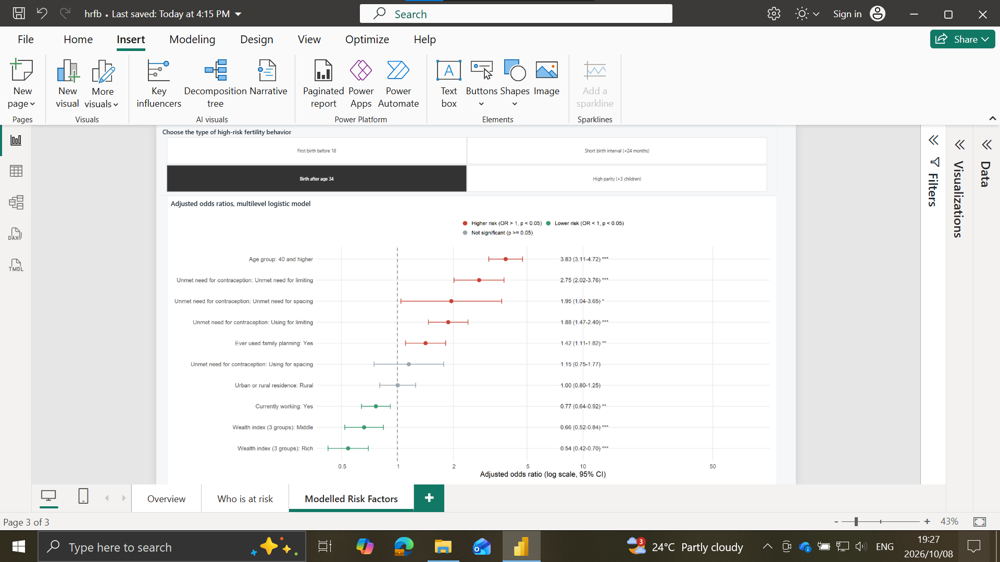

# HRFB South Africa: Power BI dashboard

An interactive Power BI report built on my Honours research into high-risk fertility behaviour (HRFB)
among South African women. It uses the 2016 South Africa Demographic and Health Survey: 8,514 women
aged 15 to 49 in 729 survey clusters.

## The three pages

| Page | Question it answers |
|---|---|
| **Overview** | How common is each type of high-risk birth, and which provinces are worst affected? |
| **Who is at risk** | How does prevalence change with wealth, education, age, residence, marital status and family-planning use, province by province? |
| **Modelled risk factors** | After adjusting for everything else, which factors raise or lower the odds? |

One outcome slicer drives every visual, so each page can be read for any of the four outcomes:
first birth before 18, birth after age 34, short birth interval (under 24 months) and high parity
(more than 3 children).

| Who is at risk | Modelled risk factors |
|---|---|
|  |  |

## What I built, and how

**Power Query**
* A `DataFolder` parameter so the whole report refreshes from any clone by changing one value.
* Every column typed explicitly with the `en-US` culture. My laptop uses South African number settings
  (comma as decimal separator), which silently turned `37.72` into `3772` until I fixed this.
* Custom M columns for labels (`OR (95% CI)` text, term labels, map locations) and an unpivoted
  long table of model metrics. The code is in [`power_query.md`](power_query.md).

**Data model**
* A star schema: four fact tables (prevalence, odds ratios, chi-square tests, model performance) and
  four dimensions (outcome, province, breakdown category, variable dictionary).
* Single-direction many-to-one relationships, sort-by-column on every categorical field so slicers
  and axes follow the natural order (Poor, Middle, Rich) rather than alphabetical order.

**DAX** (23 measures in display folders, all in [`measures.dax`](measures.dax))
* **Survey-weighted prevalence** that re-aggregates correctly under any filter:
  `DIVIDE(SUM(w_events), SUM(w_women))` over pre-aggregated weighted counts.
* **Guards against double counting.** The prevalence table stacks six breakdowns, so a measure that
  simply summed rows would count each woman six times. `HASONEVALUE` checks fall back to the
  "overall" rows whenever no single breakdown is in context.
* **DHS small-sample rule:** estimates based on fewer than 25 women are blanked, as in official DHS reports.
* A national benchmark with `REMOVEFILTERS`, a province rank with `RANKX`, "highest province" with `TOPN`,
  and dynamic titles with `SELECTEDVALUE`.
* **Map shading written in DAX.** The map colours each province into one of five bands scaled to the
  selected outcome's lowest and highest province, so the map rescales when the outcome changes.
* Measures were written and tested in **DAX query view** before being added to the model.

**Visuals**
* A filled map of the nine provinces, a bar chart against a national-average reference line, tile
  slicers synced across pages, and a matrix with gradient conditional formatting.
* A **forest plot built as an R script visual** (ggplot2) inside Power BI. It responds to the outcome
  slicer and shows adjusted odds ratios with 95% confidence intervals on a log scale, coloured by
  direction and significance. Script: [`forest_plot_r_visual.R`](forest_plot_r_visual.R).
* A custom JSON theme ([`hrfb_theme.json`](hrfb_theme.json)).

## What the data shows

* **Education has the clearest gradient.** 27 to 28% of women with primary education or none had their
  first birth before 18, against 6% of women with higher education. For high parity the gap is 41%
  against 5%.
* **Mpumalanga stands out.** It has the highest rates of both early first birth and high parity. Among
  women with only primary education there, 45% had a first birth before 18, against 28% nationally.
* **Wealth protects in every province.** High parity is about 15% among women in poor households and
  about 6% among women in rich ones.
* **Read the family-planning result with care.** Women who have ever used contraception show *more*
  high-risk births. This is cross-sectional data: many women start contraception after their
  births, so this marks the outcome rather than causing it.
* **Not every pattern holds up.** Gauteng appears to show more births after 34 among women with
  higher education, which would fit a story about delayed motherhood. But it rests on 13 births
  among 45 women, the Western Cape shows the opposite, and the adjusted model drops education for
  this outcome. I treat it as a question for further work, not a finding.

## Data

The CSVs in [`data/`](data) are produced from the R analysis by [`export_powerbi.R`](export_powerbi.R).
They contain **aggregated results only**: survey-weighted counts by province and one breakdown at a
time, odds ratios, test statistics and model metrics. No row describes an individual woman, in line
with the DHS Program's terms of use. The smallest published cell has 7 women.

"Birth after age 34" is measured among women aged 35 and over (n = 2,909), so its rate is not
comparable with the other three outcomes, which use all women aged 15 to 49.

## Run it yourself

1. Install [Power BI Desktop](https://aka.ms/pbidesktopstore) (free, Windows) and R with `ggplot2`
   for the forest plot.
2. Open [`HRFB_South_Africa.pbix`](HRFB_South_Africa.pbix).
3. **Transform data > Edit parameters** and point `DataFolder` at this repo's `powerbi/data/` folder
   (end the path with a backslash), then **Refresh**.

[`BUILD_GUIDE.md`](BUILD_GUIDE.md) walks through every step of the build.

### More screenshots
Overview for the other outcomes: [short birth interval](screenshots/01b_overview.png),
[birth after 34](screenshots/01c_overview.png), [high parity](screenshots/01d_overview.png).
Who is at risk, other breakdowns: [1](screenshots/02b_who_is_at_risk.png), [2](screenshots/02c_who_is_at_risk.png),
[3](screenshots/02d_who_is_at_risk.png), [4](screenshots/02e_who_is_at_risk.png).
Adjusted odds ratios: [short birth interval](screenshots/03b_risk_factors.png),
[birth after 34](screenshots/03c_risk_factors.png), [high parity](screenshots/03d_risk_factors.png).
